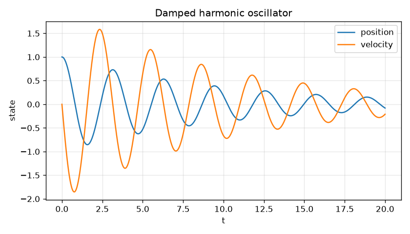
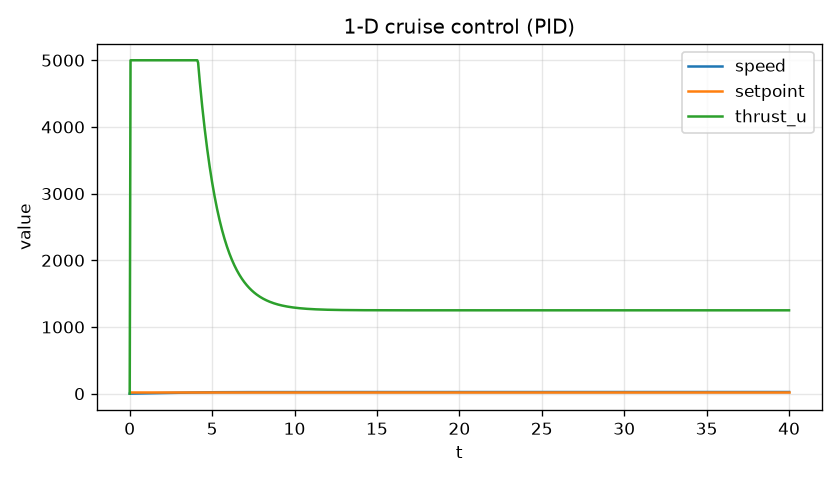
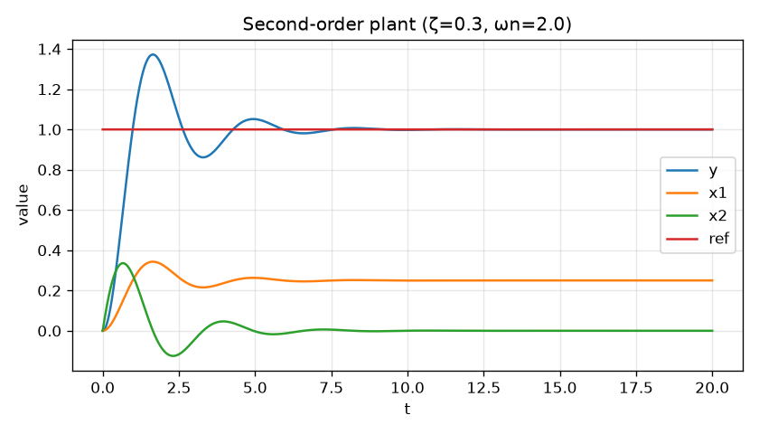
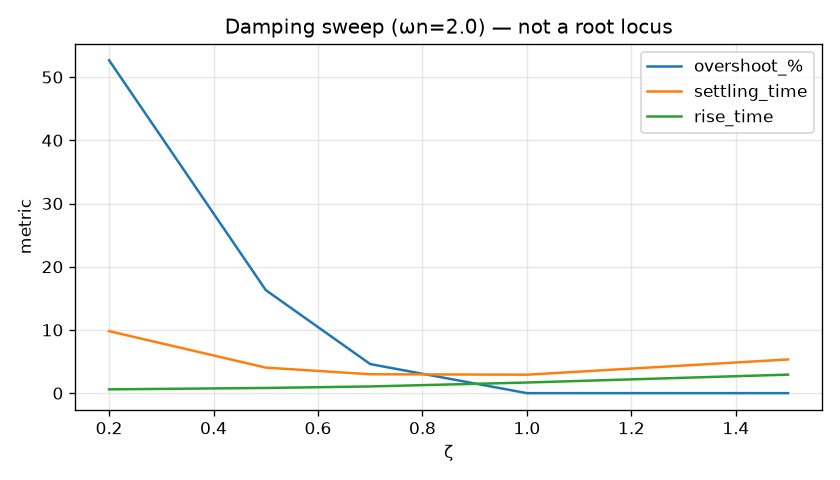

# twistdiff

Lightweight **ODE integration**, **LTI state-space**, and **PID control** demos in pure Python (CPU-only).

Educational / research portfolio library — honest numerical tooling, **not** industrial control software and **not** a fake company product.

[](LICENSE)
[](CHANGELOG.md)

## Features

- Fixed-step **Euler** and **RK4** integrators (`twistdiff.integrate`)
- Discrete **PID** with output limits and simple anti-windup (`twistdiff.PID`)
- Demo plants: **damped harmonic oscillator**, **1-D cruise control**, **second-order state-space** (`second_order_plant`)
- **Step-response metrics**: rise time, overshoot %, settling time (`step_response_metrics`)
- **Damping sweep** (root-locus-free): metrics vs ζ (`damping_sweep`)
- CLI entry point: `twistdiff`
- Optional **matplotlib** plots (`pip install 'twistdiff[plot]'`)
- **No GPU** dependencies
- Interview write-up: [`WRITEUP.md`](WRITEUP.md)

## Install

```bash
pip install -e ".[dev]"          # numpy + pytest + ruff + matplotlib
# or minimal:
pip install -e .
pip install -e ".[plot]"         # add matplotlib
```

Requires Python **3.10+**.

## Quick start (library)

```python
from twistdiff import second_order_plant, step_response_metrics

plant = second_order_plant(wn=2.0, zeta=0.3, gain=1.0)
t, y, x = plant.simulate_step(1.0, t_end=20.0, dt=0.01)
m = step_response_metrics(t, y[:, 0], y_final=1.0)
print(m.rise_time, m.overshoot_pct, m.settling_time)
```

```python
from twistdiff import damping_sweep

rows = damping_sweep([0.2, 0.5, 1.0, 1.5], wn=2.0)
for row in rows:
    print(row.zeta, row.metrics.overshoot_pct, row.metrics.settling_time)
```

```python
from twistdiff import DampedHarmonicOscillator, integrate

plant = DampedHarmonicOscillator(mass=1.0, damping=0.2, stiffness=4.0)
traj = integrate(plant.rhs(), y0=[1.0, 0.0], t_span=(0.0, 20.0), dt=0.01)
print(traj.t[-1], traj.y[-1])
```

```python
from twistdiff import CruiseControl, PID

plant = CruiseControl(mass=1000.0, drag=50.0)
pid = PID(kp=800, ki=40, kd=50, setpoint=25.0, output_limits=(0.0, 5000.0))
v, dt = 0.0, 0.05
for _ in range(800):
    u = pid.update(v, dt)
    v = v + dt * plant.accel(v, u)
print(v)  # ~ setpoint
```

## CLI

```bash
twistdiff oscillator --plot examples/oscillator.png
twistdiff cruise --plot examples/cruise.png
twistdiff second-order --zeta 0.3 --plot examples/second_order.png
twistdiff damping-sweep --zetas 0.2,0.5,0.7,1.0,1.5 --plot examples/damping_sweep.png
twistdiff --version
```

## Example plots

Regenerate with the commands above (also produced by `examples/generate_plots.py`).

### Damped harmonic oscillator



### 1-D cruise control (PID)



### Second-order plant (state-space step)



### Damping sweep (metrics vs ζ — not a root locus)



## API surface

| Symbol | Module | Role |
|--------|--------|------|
| `integrate` | `twistdiff.ode` | Fixed-step ODE solver → `Trajectory` |
| `Trajectory` | `twistdiff.ode` | `t`, `y` arrays |
| `PID` | `twistdiff.pid` | Discrete PID controller |
| `DampedHarmonicOscillator` | `twistdiff.models` | `m x'' + c x' + k x = u(t)` |
| `CruiseControl` | `twistdiff.models` | `m v' = u - b v` |
| `StateSpace` | `twistdiff.statespace` | Continuous LTI `ẋ=Ax+Bu`, `y=Cx+Du` |
| `second_order_plant` | `twistdiff.statespace` | Classic 2nd-order TF → state-space |
| `step_response_metrics` | `twistdiff.metrics` | Rise / overshoot / settling |
| `damping_sweep` | `twistdiff.sweep` | ζ sweep → step metrics (not root locus) |
| `save_trajectory_plot` | `twistdiff.plotting` | Optional matplotlib helper |

## Tests

```bash
pytest -q
ruff check src tests
```

## Project layout

```
src/twistdiff/   # library + CLI
tests/           # pytest
examples/        # PNG demos + plot generator
WRITEUP.md       # control intuition ↔ code
SECURITY.md
COMPLIANCE_NOTES.md
```

## CI

Every push runs Ruff, pytest on Python 3.10, 3.12, and 3.13, the CLI smoke plots, a gitleaks secret scan, and pip-audit. See [`.github/workflows/ci.yml`](.github/workflows/ci.yml).

## Security & compliance

- Vulnerability reports: see [`SECURITY.md`](SECURITY.md)
- Research/edu posture, no PII: see [`COMPLIANCE_NOTES.md`](COMPLIANCE_NOTES.md)

## License

MIT © 2026 Max McCutcheon (`MaxMcCutcheon1@outlook.com`)
